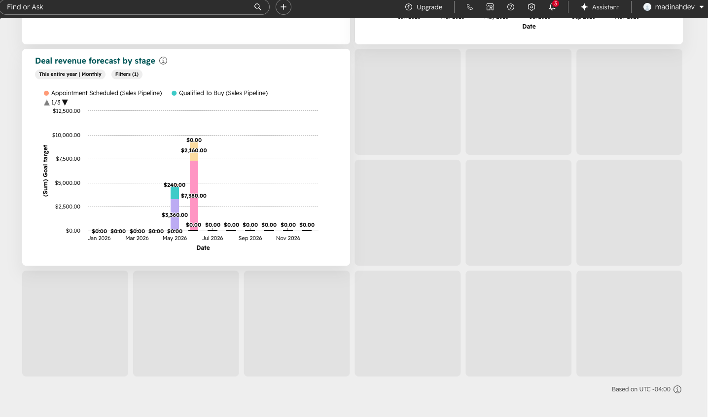
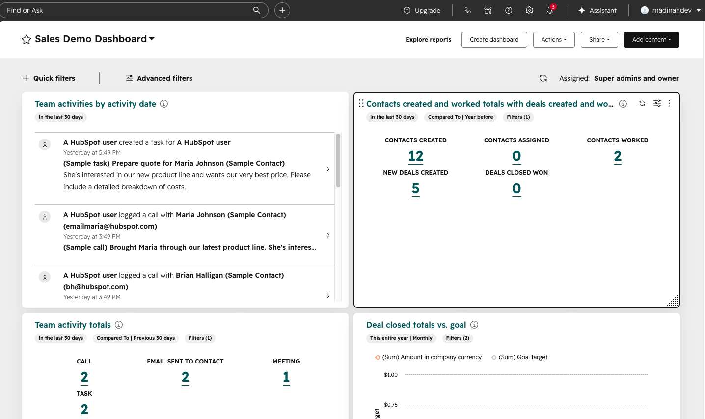
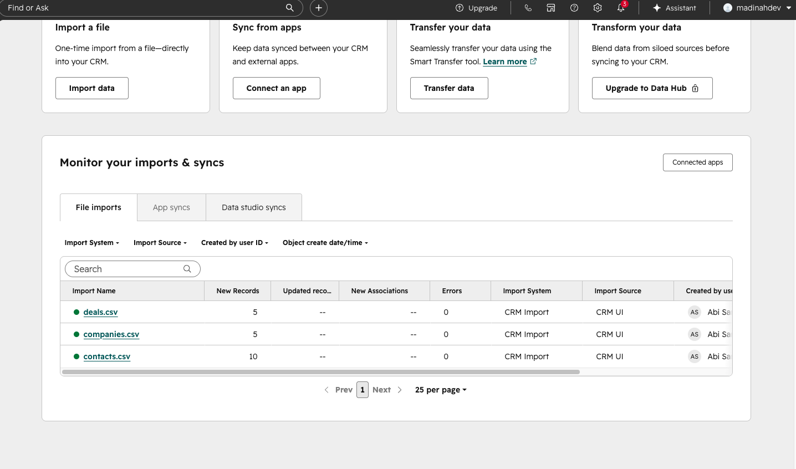
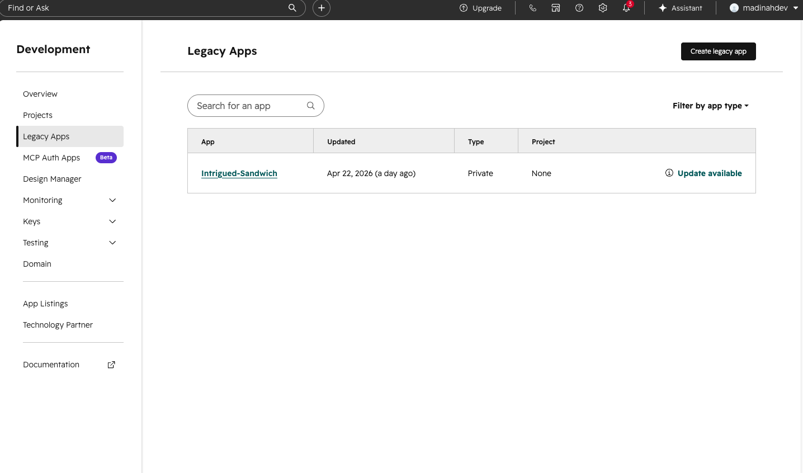

# HubSpot ETL Pipeline — Portfolio V1

Mini-plateforme **data + CRM** autour de **HubSpot**, conçue pour démontrer un savoir-faire technique en contexte réel : intégration API, pipeline ETL léger, exposition **REST** avec **FastAPI**, visualisation simple côté navigateur, packaging **Docker** et gestion de projet avec **uv**.

## Accès application

- **Production (déployée)** : [https://hubspot-api.abisarwan.com/](https://hubspot-api.abisarwan.com/)
- **Local (développement)** : [http://127.0.0.1:8000](http://127.0.0.1:8000) (port `8000`)

## Ce que ce repo démontre (recruteur)

- **Intégration HubSpot** via l’API CRM v3 (contacts, entreprises, deals) avec token d’accès **côté serveur uniquement**.
- **Architecture Python modulaire** : client HTTP dédié, services ETL (extract / transform / load), routeur API, configuration centralisée.
- **API REST** documentable (FastAPI) et consommation côté UI en **Vanilla JS** (fetch), sans exposer de secrets.
- **ETL orienté fichiers** : exports CSV dans `data/raw` (payload HubSpot) et `data/processed` (données normalisées).
- **Expérience utilisateur** : dashboard avec indicateur de chargement pendant les appels HubSpot, gestion d’erreurs lisible.
- **Industrialisation** : `Dockerfile`, lockfile `uv`, `.env.example`, structure de projet claire.

## Aperçu visuel (captures)

### Dashboard analytics (données de démo HubSpot)

Vue d’ensemble des KPI, graphiques (Chart.js) et listes récentes, alimentés par les endpoints `/api/*`.





### Préparation côté HubSpot (contexte métier)

Import de fichiers de démonstration dans le portail HubSpot (jeu de données CRM cohérent pour la démo).



Configuration d’une application / token d’accès pour consommer l’API (accès contrôlé, scopes à définir selon les objets).



## Stack

| Domaine | Choix |
| --- | --- |
| Langage | Python 3.12 |
| API | FastAPI |
| HTTP client | httpx |
| Config | python-dotenv |
| Templates | Jinja2 (page `/`) |
| UI dashboard | Vanilla JS + Tailwind (CDN) + Chart.js (CDN) |
| Packaging deps | uv (`pyproject.toml`, `uv.lock`) |
| Conteneur | Docker |

## Architecture (résumé)

```text
Navigateur  →  FastAPI (/ et /api/*)
                    ↓
            services ETL (extract / transform / load)
                    ↓
            client HubSpot (httpx, pagination)
                    ↓
            API HubSpot (CRM v3)
```

Dossiers principaux :

```text
hubspot-etl-pipeline/
├── .env.example
├── pyproject.toml
├── uv.lock
├── Dockerfile
├── data/
│   ├── raw/              # exports bruts (gitignored)
│   ├── processed/        # exports normalisés (gitignored)
│   └── *.csv             # jeux de démo optionnels à la racine data/
├── images/screenshoot/   # captures pour README / portfolio
├── app/
│   ├── main.py
│   ├── config.py
│   ├── clients/hubspot_client.py
│   ├── routers/api.py
│   ├── services/
│   │   ├── extract_service.py
│   │   ├── transform_service.py
│   │   ├── load_service.py
│   │   └── summary_service.py
│   ├── templates/index.html
│   └── static/style.css
└── tests/
```

## Configuration

1. Copier les variables d’environnement :

```bash
cp .env.example .env
```

2. Renseigner dans `.env` :

- `HUBSPOT_ACCESS_TOKEN` — token d’accès (private app / token serveur).
- `CLIENT_SECRET` — présent pour alignement avec ton compte HubSpot ; **non utilisé en V1** (pas d’OAuth dans cette version).
- `HUBSPOT_BASE_URL` — optionnel, par défaut `https://api.hubapi.com`.

## Installation et exécution locale (uv)

```bash
uv sync
uv run uvicorn app.main:app --reload
```

Application : [http://127.0.0.1:8000](http://127.0.0.1:8000)

## Docker

```bash
docker build -t hubspot-etl-pipeline .
docker run --rm -p 8000:8000 --env-file .env hubspot-etl-pipeline
```

Puis ouvrir [http://127.0.0.1:8000](http://127.0.0.1:8000).

## Endpoints V1

| Méthode | Chemin | Rôle |
| --- | --- | --- |
| GET | `/` | Page dashboard (HTML + chargement des données via `/api/*`) |
| GET | `/api/contacts` | Liste des contacts (propriétés utiles) |
| GET | `/api/companies` | Liste des entreprises |
| GET | `/api/deals` | Liste des deals |
| GET | `/api/summary` | KPI agrégés (totaux + montant deals) |

Propriétés HubSpot ciblées (V1) :

- **Contacts** : `firstname`, `lastname`, `email`, `phone`
- **Companies** : `name`, `domain`, `industry`, `phone`
- **Deals** : `dealname`, `amount`, `dealstage`, `pipeline`, `closedate`

## Sécurité (important en production et en candidature)

- Le **token HubSpot ne sort jamais** vers le navigateur : seul le backend appelle HubSpot.
- Le frontend consomme **uniquement** ton API FastAPI sur le même origine en local.
- Ne jamais committer `.env` ni secrets (fichier ignoré par Git).

## Limites assumées (V1 honnête)

- Pas d’OAuth HubSpot dans cette version (token statique / private app).
- Pas de base de données : persistance fichier CSV pour la démo ETL.
- Pas de file d’attente / worker : synchronisation déclenchée par requêtes HTTP.

## Pistes V2 (évolutions possibles du projet)

- OAuth2 HubSpot + refresh token, rotation des secrets.
- Persistance SQL + modèle de données + idempotence du load.
- Cache Redis et rate limiting côté API.
- CI (lint + tests) et OpenAPI publiée.

---

Projet orienté **portfolio** : lisible, expliquable en 5 minutes, extensible sans sur-ingénierie.
